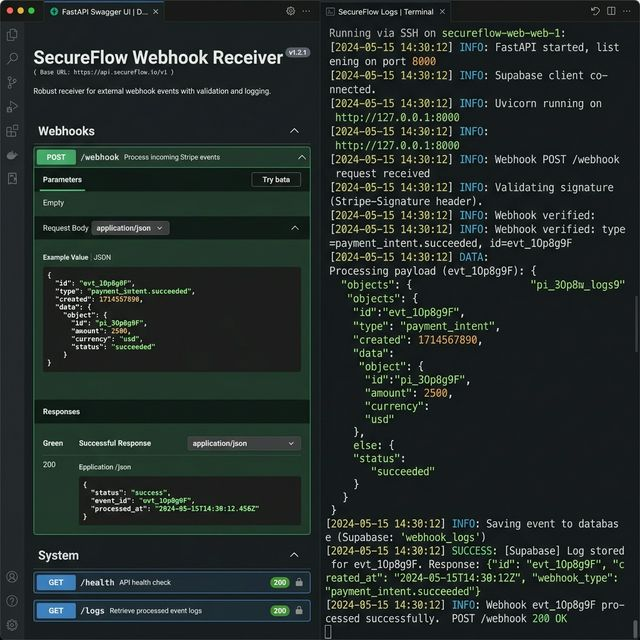

# High-Volume Webhook Processor

A production-ready webhook receiver that securely captures, validates, and stores incoming events from third-party services like Stripe or GitHub.

✔ Prevents data loss during traffic spikes with a high-throughput async architecture
✔ Secures your system against malicious payloads using HMAC-SHA256 signature verification
✔ Provides immediate visibility into webhook health and history via structured logging and Supabase integration

## Use Cases
- **Payment Processing:** Securely receive and verify Stripe or PayPal subscription events.
- **Third-Party Integrations:** Act as a reliable middle-layer to catch events from GitHub, Shopify, or CRMs before routing them.
- **Event Logging:** Build a resilient audit trail of all incoming webhooks for compliance or debugging.

## Project Structure

```
fastapi-webhook-receiver/
├── main.py             # FastAPI application
├── requirements.txt
└── .env.example
```

## Setup

```bash
pip install -r requirements.txt
cp .env.example .env
# Edit .env (Supabase credentials optional)
```

## Supabase Table

If using Supabase, create this table:

```sql
create table webhook_logs (
  event_id     text primary key,
  source       text,
  event_type   text,
  payload      jsonb,
  received_at  timestamptz
);
```

## Running

```bash
uvicorn main:app --host 0.0.0.0 --port 8000 --reload
```

API docs: http://localhost:8000/docs

## Endpoints

### `GET /health`
```json
{
  "status": "ok",
  "timestamp": "2024-05-15T10:00:00+00:00",
  "supabase_connected": true
}
```

### `POST /webhook`
Headers:
- `X-Hub-Signature-256: sha256=<hmac>` (optional, required if `WEBHOOK_SECRET` set)
- `X-Event-Source: github`
- `X-Event-Type: push`

Response `202 Accepted`:
```json
{
  "accepted": true,
  "event_id": "550e8400-e29b-41d4-a716-446655440000"
}
```

### `GET /logs?limit=20`
```json
{
  "count": 2,
  "logs": [
    {
      "event_id": "...",
      "source": "github",
      "event_type": "push",
      "payload": {...},
      "received_at": "2024-05-15T10:00:00+00:00"
    }
  ]
}
```

## Tech Stack

`fastapi` · `uvicorn` · `pydantic` · `supabase` · `python-dotenv`

## Screenshot



