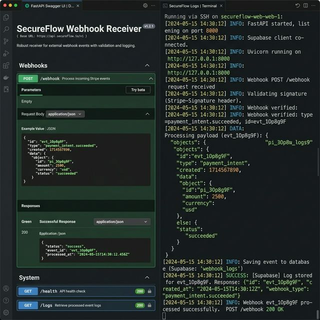

# High-Volume Webhook Processor

A production-ready webhook receiver that securely captures, validates, and stores incoming events from third-party services like Stripe or GitHub.

✔ Prevents data loss during traffic spikes with a high-throughput async architecture
✔ Secures your system against malicious payloads using HMAC-SHA256 signature verification
✔ Provides immediate visibility into webhook health and history via structured logging and Supabase integration

## Use Cases
- **Payment Processing:** Securely receive and verify Stripe or PayPal subscription events.
- **Third-Party Integrations:** Act as a reliable middle-layer to catch events from GitHub, Shopify, or CRMs before routing them.
- **Event Logging:** Build a resilient audit trail of all incoming webhooks for compliance or debugging.

## Project Structure

```
fastapi-webhook-receiver/
├── main.py                      # FastAPI application
├── scripts/send_test_webhook.py # Signed test sender / quick load test
├── tests/                       # pytest suite
├── requirements.txt
└── .env.example
```

## Setup

```bash
pip install -r requirements.txt
cp .env.example .env
# Set WEBHOOK_SECRET and LOGS_API_KEY (Supabase optional)
```

## Supabase Table

If using Supabase, create this table:

```sql
create table webhook_logs (
  event_id     text primary key,
  delivery_id  text,
  source       text,
  event_type   text,
  payload      jsonb,
  received_at  timestamptz
);
create index on webhook_logs (received_at desc);
create unique index on webhook_logs (delivery_id) where delivery_id is not null;
```

## Running

```bash
uvicorn main:app --host 0.0.0.0 --port 8000
```

API docs: http://localhost:8000/docs

## How it handles volume

- **Fast acknowledgement** – the request returns `202` as soon as the signature is checked; database writes
  happen in a background worker, so a slow database never slows senders down.
- **Batched writes** – events are written to Supabase in batches (`BATCH_SIZE` / `BATCH_INTERVAL`) with retries.
- **Back-pressure** – when the queue (`QUEUE_SIZE`) is full the API answers `503` + `Retry-After`,
  so well-behaved senders retry instead of events being silently lost.
- **Idempotency** – `X-Delivery-Id` / `X-GitHub-Delivery` duplicates are acknowledged but stored once.
- **Graceful shutdown** – queued events are flushed before the process exits.

## Security

- Signature is **required**: `X-Hub-Signature-256` (or `X-Signature`) = `sha256=HMAC_SHA256(secret, raw body)`.
  Without `WEBHOOK_SECRET` every request is refused unless `ALLOW_UNSIGNED=true` (local testing only).
- Constant-time comparison, body size limit (`MAX_BODY_BYTES`, `413` above it).
- `/logs` and `/metrics` require `X-API-Key: <LOGS_API_KEY>` — payloads are never public.

## Endpoints

### `GET /health`
```json
{
  "status": "ok",
  "timestamp": "2024-05-15T10:00:00+00:00",
  "supabase_connected": true,
  "queue_depth": 0
}
```

### `POST /webhook`
Headers:
- `X-Hub-Signature-256: sha256=<hmac>` (required)
- `X-Event-Source: shop` / `X-Event-Type: order.created` (optional; GitHub's `X-GitHub-Event` is recognised)
- `X-Delivery-Id: <unique id>` (optional, enables de-duplication)

Response `202 Accepted`:
```json
{
  "accepted": true,
  "event_id": "550e8400-e29b-41d4-a716-446655440000"
}
```

| Status | Meaning |
|---|---|
| `202` | Accepted |
| `200` | Duplicate delivery, already stored |
| `401` | Bad signature |
| `413` | Body too large |
| `503` | Queue full (retry) or receiver not configured |

### `GET /logs?limit=20&source=github&event_type=push` (X-API-Key)
```json
{
  "count": 1,
  "logs": [
    {
      "event_id": "...",
      "delivery_id": "...",
      "source": "github",
      "event_type": "push",
      "payload": {"...": "..."},
      "received_at": "2024-05-15T10:00:00+00:00"
    }
  ]
}
```

### `GET /metrics` (X-API-Key)
Counters since start-up: `received`, `duplicates`, `rejected`, `persisted`, `persist_errors`, `queue_depth`.

## Sending test webhooks

```bash
python scripts/send_test_webhook.py                     # one signed event
python scripts/send_test_webhook.py --count 2000 -c 50  # quick load test
```

## Tests

```bash
pip install -r requirements-dev.txt
pytest -q
```

## Tech Stack

`fastapi` · `uvicorn` · `pydantic` · `supabase` · `python-dotenv`

## Screenshot



